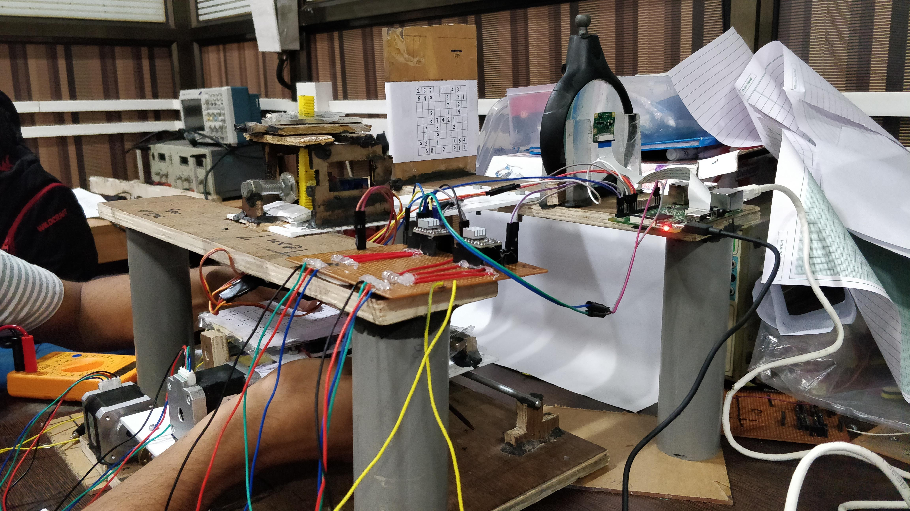
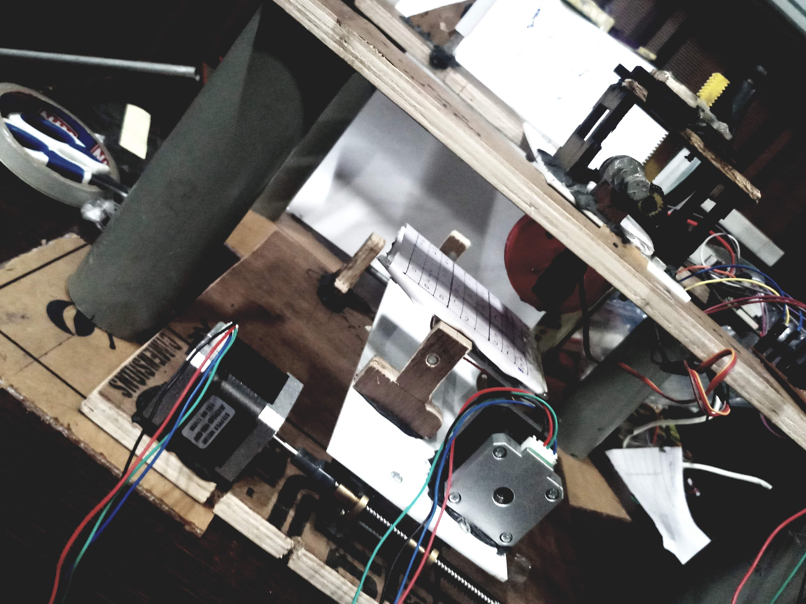
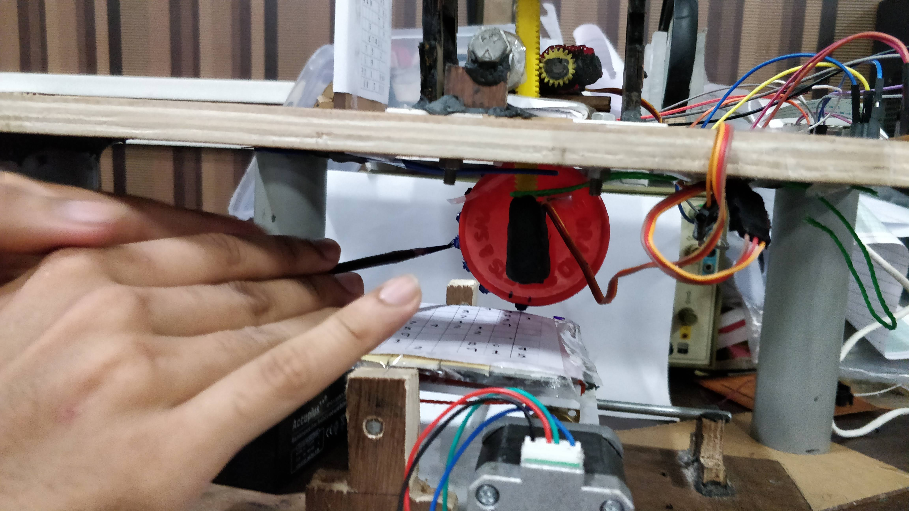
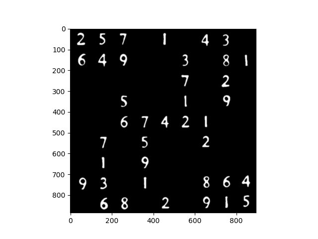
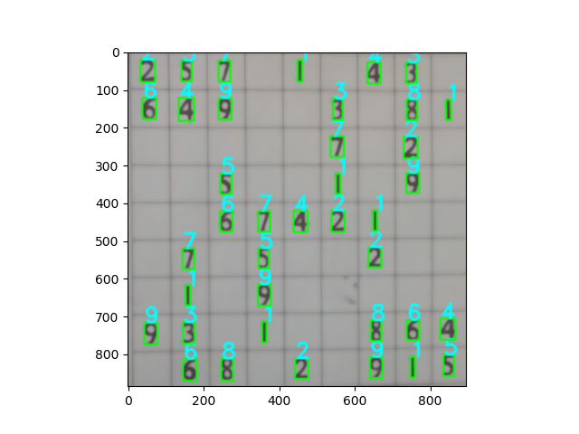

# ITSP-2018

## Sudoku Solver Using Block Printing

As part of the Institute Technical Summer Project at IIT Bombay, my team implemented a Raspian-based CNC Machine to physically fill into any given unsolved Sudoku grid.

***

Two phases: Digit recognition and Motor control. Code written in Python.

Key Components: Raspberry Pi 3B, Camera Module, 2 Steppers, 2 Servos, Number Stamp

## Overview

## Motors

## Number Stamp

## Image Processing
#### <pre>Thresholded:</pre>

#### <pre>Labelled:</pre>

## Authors

* **Siddharth Saha** - [trunc8](https://github.com/trunc8)
* **Arnab Jana**
* **Madhur Sudarshan**
* **Aaron John Sabu**

Created with :heart: by <a href="https://www.linkedin.com/in/sahasiddharth611/">Siddharth</a>
